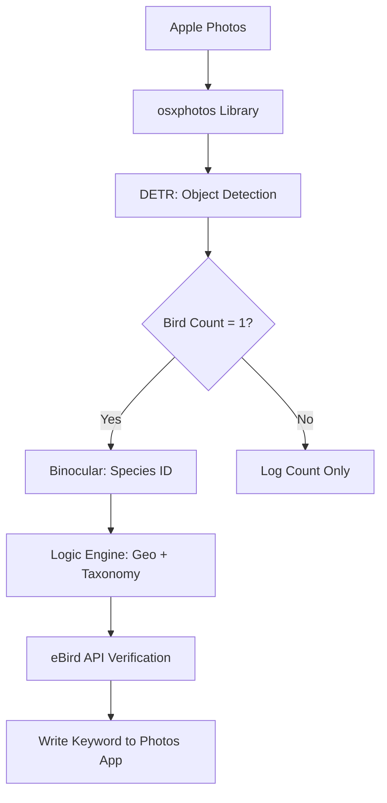

# Apple Photos Bird Intelligence - APBI

Apple Photos Bird Intelligence is a specialized pipeline that bridges the gap between raw AI object detection and expert-level birding logic. It scans your Apple Photos library, detects, counts and classifies birds, and applies bio-geographic overrides to ensure your metadata reflects biological reality, not just AI guesses.

## 🚀 The Core Concept
Standard AI models often lack the context to know that a specific bird shouldn't exist in a certain location. This module uses spatial metadata and taxonomic grouping to "clean" identification results before writing them back to your Photos library as searchable keywords.

## ✨ Key Features
- **Apple Photos Integration:** Automatically writes species names as searchable keywords (Keywords/Tags) into your Photos app.
- **Bio-Geographic Overrides:** Spatial logic to correct species based on location (e.g., Island Scrub-Jay corrections).
- **Taxonomic Grouping:** Combines confidence scores for difficult-to-distinguish groups (Hummingbirds, Gulls, Grebes).
- **Quality Scoring:** Uses **NIQE** (Natural Image Quality Evaluator) to determine the sharpness of bird crops. Note that this still needs improvement. The image gets a good score when there are too many branches or a lower score if the bird is floating in water.
- **eBird Verification:** Cross-references detections with real-time local sightings via the eBird API. TODO

## 📊 Logic Engine: Handling AI Inconsistencies
APBI doesn't just take the top AI result. It applies specific rules to handle "look-alike" complexes:

### 1. Spatial Logic (The Island Rule)
If the AI identifies a **Western Scrub-Jay** but the GPS coordinates place it in the **Channel Islands**, the script automatically renames it to the endemic **Island Scrub-Jay**.

### 2. Confidence Summing (Complex Groups)
For species that are notoriously difficult for AI to split, APBI sums the top two results. If the sum is > 99%, it uses a broader, more accurate label:


| AI Top 2 Candidates | Summed Conf | Final Label |
| :--- | :--- | :--- |
| Western Grebe / Clark's Grebe | > 99% | **Western/Clark Grebe** |
| Any two Hummingbirds | > 99% | **Hummingbird** |
| Gulls / Terns / Loons | > 99% | **[Group Name]** |
| Sandhill / Whooping Crane | > 99% | **Crane** |

### 3. Safety Labeling
- **Green Heron:** Labeled as "Green Heron or Young Black-crowned Night-Heron" to account for frequent juvenile misidentification.
- **Cranes:** Detections are generalized to "Crane" to prevent false positives for the endangered Whooping Crane.

## 🛠️ Architecture


## 💻 Setup & Installation

### Requirements
- **macOS** (For Apple Photos access)
- **Python 3.11+**
- **eBird API Key**

### Installation
1. Clone the repository.
2. Install dependencies:
   ```bash
   pip install -r requirements.txt
   ```
3. Set your API keys in the script:
   - `HF_API`: Your Hugging Face token.
   - `EBIRD_API_KEY`: Your eBird developer key.

## 📝 Usage
Run the main script to process your "Birds" album:
```bash
python main.py
```
*Note: Ensure the Photos App is closed during database write operations.*

## 🌍 Non-US Bird Data with iNaturalist
If your birds are outside the US, use `inaturalist.py` to download species data for a country or region.
- `inaturalist.py` can fetch bird observations from iNaturalist for a given region.
- It can save around 30 bird images per species by downloading and cropping candidate photos.

Example:
```bash
python inaturalist.py
```
This script currently supports region-specific place IDs and saves images into folders like `processed_<region>_birds`.

## 🧪 Linear Probe and Fine-Tune DINOv2
After collecting non-US bird images, use `probe_fine_tune.py` to:
- linear probe the DINOv2 model
- fine-tune DINOv2 on your region-specific bird data

This makes the model more adapted to your local species and image distribution.

## 🔧 About `main.py`
`main.py` currently uses a US-focused classifier and hard-coded regional assumptions. In the future, it can be updated to use a region-specific classifier trained on data from `inaturalist.py` and `probe_fine_tune.py`.

## ⚖️ License
This project is licensed under the MIT License. Models used: [Facebook DETR](https://huggingface.co) and [Binocular Bird Classifier](https://huggingface.co`).
