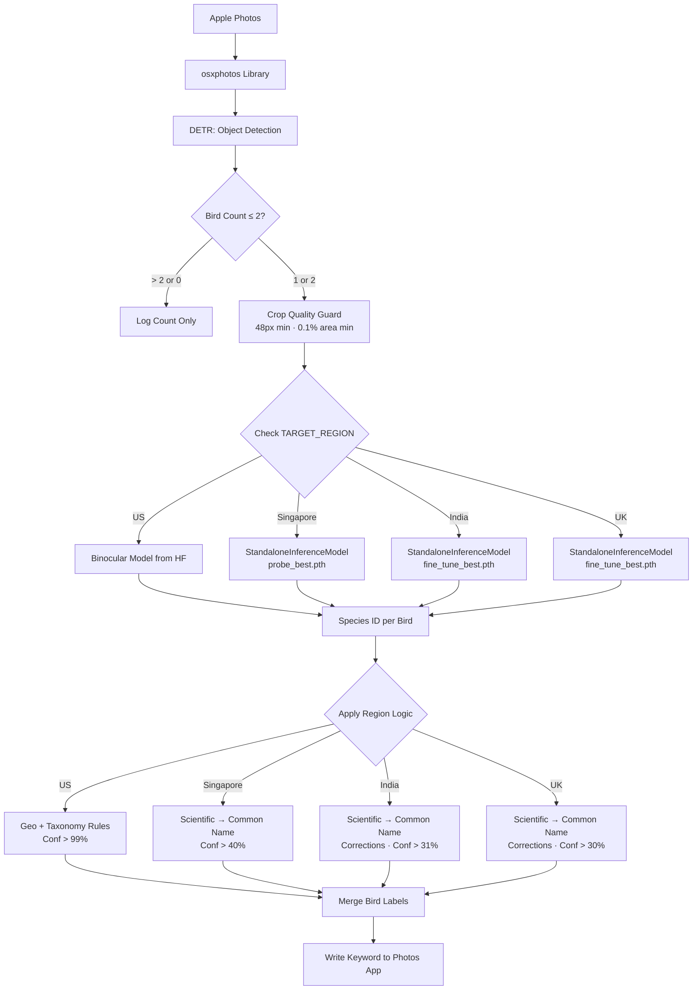
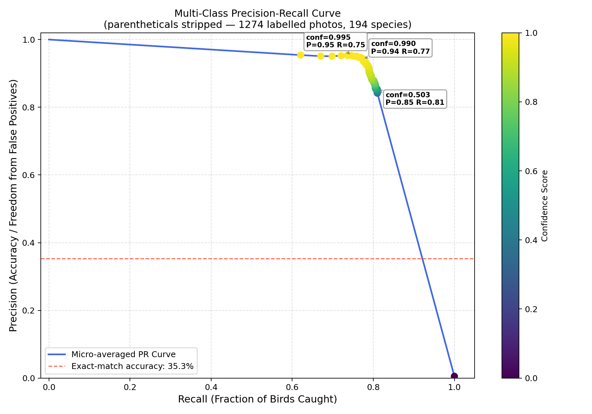
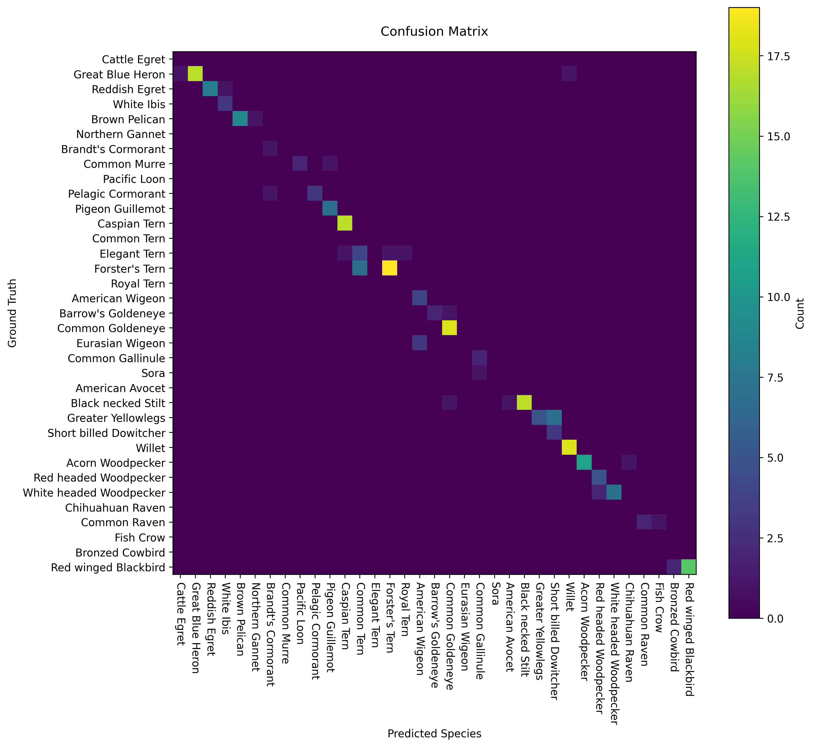
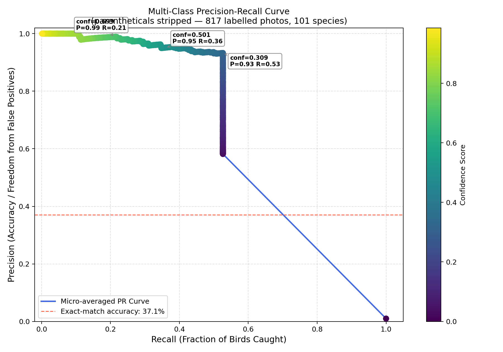
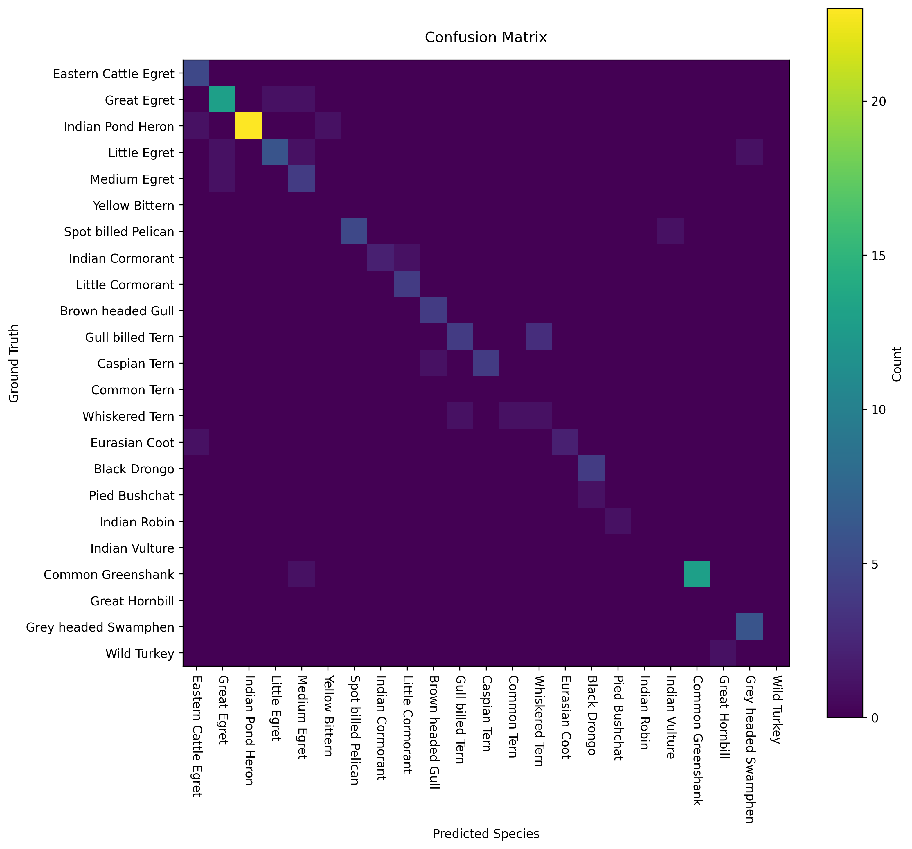

# Apple Photos Bird Intelligence (APBI)

Apple Photos Bird Intelligence is a specialized pipeline that bridges the gap between raw AI object detection and expert-level birding logic. It scans your Apple Photos library, detects, counts, and classifies birds, then applies bio-geographic overrides to ensure your metadata reflects biological reality — not just AI guesses.

## 🚀 The Core Concept
Standard AI models often lack the context to know that a specific bird shouldn't exist in a certain location. This module uses spatial metadata and taxonomic grouping to "clean" identification results before writing them back to your Photos library as searchable keywords.

## ✨ Key Features
- **Apple Photos Integration:** Automatically writes species names as searchable keywords into your Photos app.
- **Multi-Region Support:** Configure for US, Singapore, India, or UK — each with region-specific classifiers, confidence thresholds, and species corrections.
- **Scientific-to-Common Name Conversion:** Non-US regions map scientific model output to common names via `regional_birds.csv`.
- **Bio-Geographic Overrides:** Spatial logic corrects species based on GPS coordinates (e.g., Island Scrub-Jay vs California Scrub-Jay).
- **Taxonomic Grouping:** Combines confidence scores for difficult-to-distinguish groups (Hummingbirds, Gulls, Grebes, Cranes).
- **Multi-Bird Classification:** Classifies photos with up to 2 detected birds. When 2 different species are identified, **two independent keywords** are written (e.g., `"Bird: House Sparrow"` and `"Bird: Common Myna"`), so Photos search works correctly for each species individually. Same-species detections produce a single tag.
- **Crop Quality Guards:** Rejects crops smaller than 48×48 px or less than 0.1% of image area, preventing foliage blobs and distant specks from reaching the classifier.
- **Quality Scoring:** Uses **NIQE** (Natural Image Quality Evaluator) to score sharpness of bird crops. Note: images with water or heavy foliage can skew scores; this metric is still being refined.

## 📊 Logic Engine: Handling AI Inconsistencies

APBI doesn't just take the top AI result. It applies a layered set of rules to handle "look-alike" species complexes.

### 1. Spatial Logic (US Only)
If the AI identifies a **Western Scrub-Jay** but GPS coordinates place it in the **Channel Islands**, the script automatically renames it to the endemic **Island Scrub-Jay**.

### 2. Confidence Summing — Complex Groups (US Only)
For species that are notoriously difficult for AI to split, APBI sums the top two confidence scores. If the sum exceeds 99%, it uses a broader, more accurate label:

| AI Top 2 Candidates | Summed Conf | Final Label |
| :--- | :--- | :--- |
| Western Grebe / Clark's Grebe | > 99% | **Western/Clark's Grebe** |
| Any two Hummingbirds | > 99% | **Hummingbird** |
| Any two Gulls | > 99% | **Gull** |
| Subspecies of the same species | > 99% | **Base species name** |

### 3. Safety Labeling (US Only)
- **Green Heron:** Labeled as "Green Heron or Young Black-crowned Night-Heron" to account for frequent juvenile misidentification.
- **Cranes:** Generalized to "Crane" to prevent false positives for the endangered Whooping Crane.

### 4. Known Misclassification Corrections

Each region maintains a corrections table to fix systematic model errors:

**US**
| Model Predicts | Corrected To |
| :--- | :--- |
| Tennessee Warbler | Orange-crowned Warbler |
| Pileated Woodpecker | White-headed Woodpecker |
| Snow Goose | Ross's Goose |
| Surfbird | Dunlin |
| Downy Woodpecker | Hairy Woodpecker |
| Wilson's Phalarope | Red-necked Phalarope |

**UK** (confidence threshold: > 30%)
| Model Predicts | Corrected To |
| :--- | :--- |
| Whooper Swan | Mute Swan |
| Ring-billed Gull | Common Gull |

**India** (confidence threshold: > 31%)
| Model Predicts | Corrected To |
| :--- | :--- |
| Great White Pelican | Spot-billed Pelican |
| Marsh Sandpiper | Common Greenshank |
| Tawny Eagle | Black Kite |
| Dusky Crag-Martin | Little Cormorant |
| Thick-billed Flowerpecker | Ashy Woodswallow |
| Blue-cheeked Bee-eater | Blue-tailed Bee-eater |

### 5. Date-Specific Corrections (US Only)
Rare one-off sightings that the model cannot know about are stored in `us_date_corrections.csv`. Each row maps a `(date, from_label)` pair to a corrected species. Edit the CSV to add new entries — no code change required.

### 6. Composite Label Exclusion from Evaluation (US Only)
Intentionally ambiguous labels (`Gull`, `Hummingbird`, `Crane`, `Western/Clark's Grebe`, `Green Heron or Young Black-crowned Night-Heron`) are excluded from the F1 chart and confusion matrix. They represent deliberate uncertainty decisions — not model errors — and including them would distort per-species metrics. Configured via `composite_labels` in `REGION_CONFIG`.

## 📈 Analytics & Visualizations

Each run produces the following output files (all timestamped):

**Project root**
| File | Type | Description |
| :--- | :--- | :--- |
| `{region}_classified_birds_report_{ts}.csv` | CSV | Per-photo detection and classification results |
| `{region}_classified_birds_report_{ts}.html` | Plotly | Interactive species distribution bar chart |
| `{region}_geo_map_{ts}.html` | Plotly | Geographic scatter map of labeled photo locations |
| `{region}_temporal_{ts}.html` | Plotly | Bird photos per calendar month |

**`assets/` folder**
| File | Type | Description |
| :--- | :--- | :--- |
| `assets/{region}_confusion_matrix_{ts}.png` | PNG | Confusion matrix ordered by taxonomic group (composite labels excluded) |
| `assets/{region}_precision_recall_curve_{ts}.png` | PNG | Micro-averaged PR curve with adaptive y-axis and annotated operating points |
| `assets/{region}_f1_by_species_{ts}.html` | Plotly | Per-species F1 sorted ascending — includes species with F1=0 (never confidently predicted) |
| `assets/{region}_confidence_histogram_{ts}.png` | PNG | Correct vs incorrect confidence distributions with operating threshold line |
| `assets/{region}_coverage_precision_{ts}.png` | PNG | Coverage (fraction labeled) at each precision level — operating point annotated at label-generation threshold |

**mAP** (macro-averaged) is also printed to stdout for quick cross-region comparison.

### Keyword Sync Behaviour
`sync_keywords_from_csv` writes `Bird:` keywords back to Photos after each run:
- **2-bird photos:** two separate keywords written (`Bird: Species1`, `Bird: Species2`) — each is independently searchable
- **Manual tag matching:** if a photo has `Manual:` tags, all of them must match the predicted species as a set (case-insensitive) before the sync proceeds; partial matches leave the photo untouched
- **Ground truth fallback:** `Manual:` tags are used as `current_label` ground truth when `Bird:` tags haven't been synced yet, ensuring evaluation metrics are correct on first run

## 🛠️ Architecture


## 💻 Setup & Installation

### Requirements
- **macOS** (required for Apple Photos access)
- **Python 3.11+**
- **Hugging Face API token** (`HF_TOKEN` in your `.env` file)

### Installation
1. Clone the repository.
2. Install dependencies:
   ```bash
   pip install -r requirements.txt
   ```
3. Create a `.env` file and add your Hugging Face token:
   ```
   HF_TOKEN=your_token_here
   ```

## 📝 Usage
Run the main script to process your "Birds" album:
```bash
python main.py
```
> **Note:** Ensure Photos is closed during database write operations to avoid conflicts.

## ⚙️ Configuration

Edit `TARGET_REGION` and `REGION_CONFIG` at the top of `main.py`:

```python
TARGET_REGION = "India"  # Options: "US", "Singapore", "India", "UK"
```

### Region Behaviour Summary
| Region | Model Source | Confidence Threshold | Name Conversion | Extra Logic |
| :--- | :--- | :--- | :--- | :--- |
| US | Binocular (HF) | 99% | — | Geo overrides, taxonomy grouping, date corrections CSV |
| Singapore | Standalone (HF) | 40% | Scientific → Common | — |
| India | Standalone (HF) | 31% | Scientific → Common | Species corrections |
| UK | Standalone (HF) | 30% | Scientific → Common | Species corrections |

## 🌍 Non-US Bird Data with iNaturalist
For regions outside the US, use `inaturalist.py` to download training data.
- Fetches bird observations from iNaturalist for a given region or place ID.
- Downloads and crops approximately 30 images per species (single-bird crops only).
- Saves images into folders named `processed_<region>_birds`.

```bash
python inaturalist.py
```

## 🧪 Training: Linear Probe and Fine-Tune DINOv2
After collecting regional images, use `dinov2_probe_fine_tune.py` to adapt the model:
- **Linear probe** — trains a classification head on frozen DINOv2 features.
- **Fine-tune** — unfreezes the encoder for deeper adaptation to local species.
- Uses a **stratified 80/20 train/val split** to guarantee every species appears in both sets, which matters when each class has only ~30 images.

```bash
# Step 1: linear probe
python dinov2_probe_fine_tune.py --epochs 30 --lr 2e-4 --freeze_encoder --experiment_name probe

# Step 2: fine-tune from probe checkpoint
python dinov2_probe_fine_tune.py --epochs 30 --lr 1e-5 --resume <path_to_probe_best.pth> --experiment_name finetune
```

## 📈 Model Performance (US Region)

### Precision-Recall Curve


The curve shows model performance across the 0.99–1.00 confidence band used by the US pipeline.
At the operating threshold (conf ≥ 0.99): **P=0.95, R=0.89** across 176 species.

### Confusion Matrix
The confusion matrix (species ordered by taxonomic sequence)

The model recognizes juvenile Black-crowned Night Heron as Green Heron; rare Eurasian Wigeon as American Wigeon; 
Hummingbirds, Gulls, Grebes and Woodpeckers separation has to be improved further with training.

## 📈 Model Performance (India Region)

### Precision-Recall Curve


The curve shows model performance across the confidence band used by the India region pipeline.
At the operating threshold (conf ≥ 0.31): **mAP=0.562** across 82 species.

### Confusion Matrix
The confusion matrix (species ordered by taxonomic sequence)

Egrets, Cormorants, Gulls & Terns and Blackbirds are the ones that the model needs to be trained on to improve performance further.

## ⚖️ License
This project is licensed under the MIT License. Models used: [Facebook DETR](https://huggingface.co/facebook/detr-resnet-50) and [Binocular Bird Classifier](https://huggingface.co/jiujiuche/binocular).
